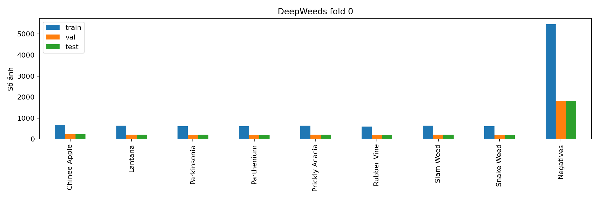
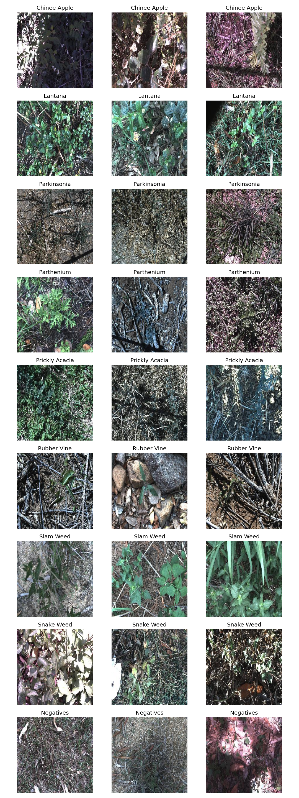
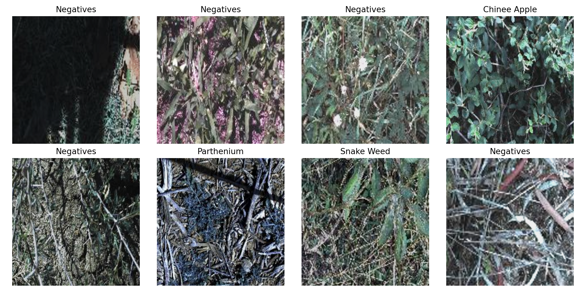
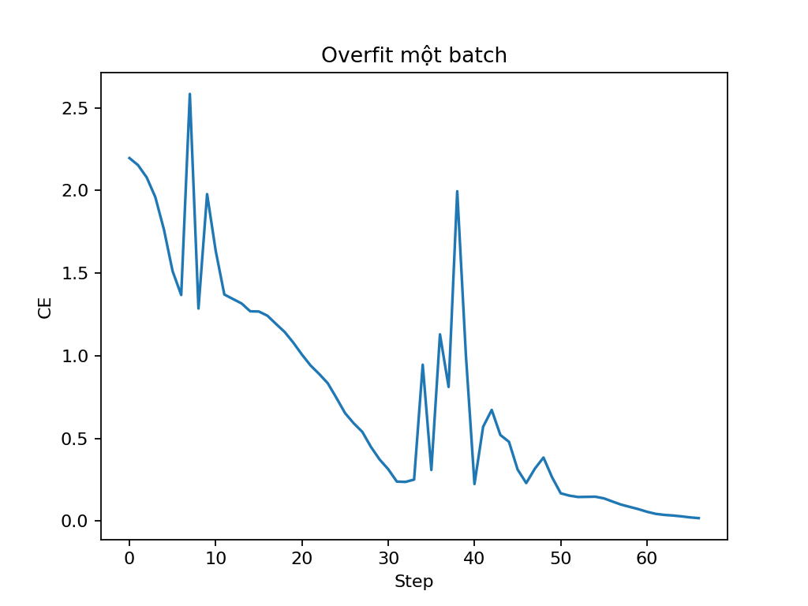
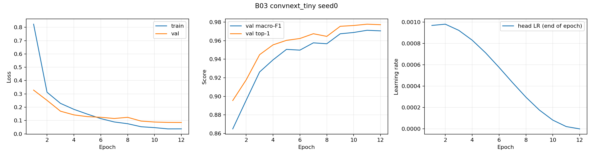
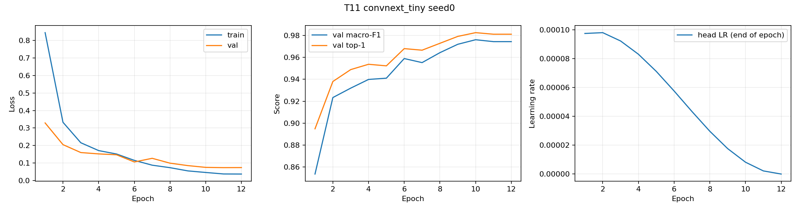
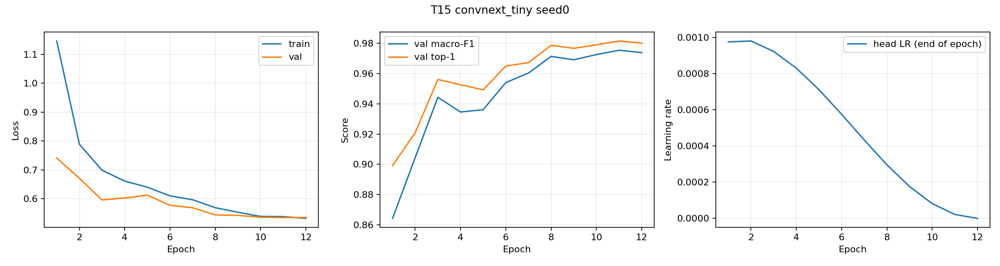
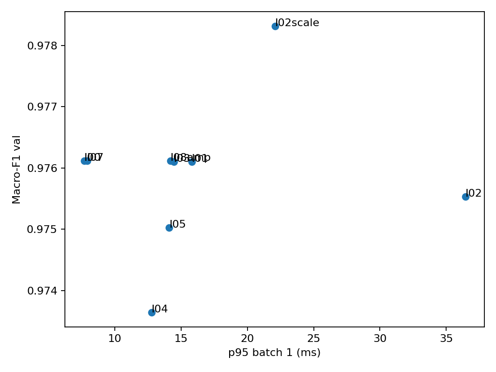
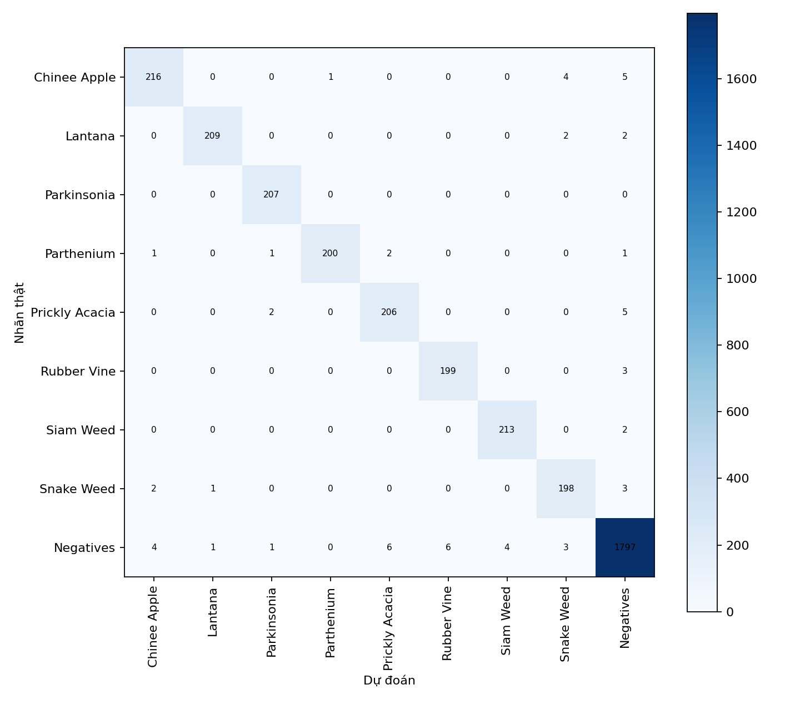
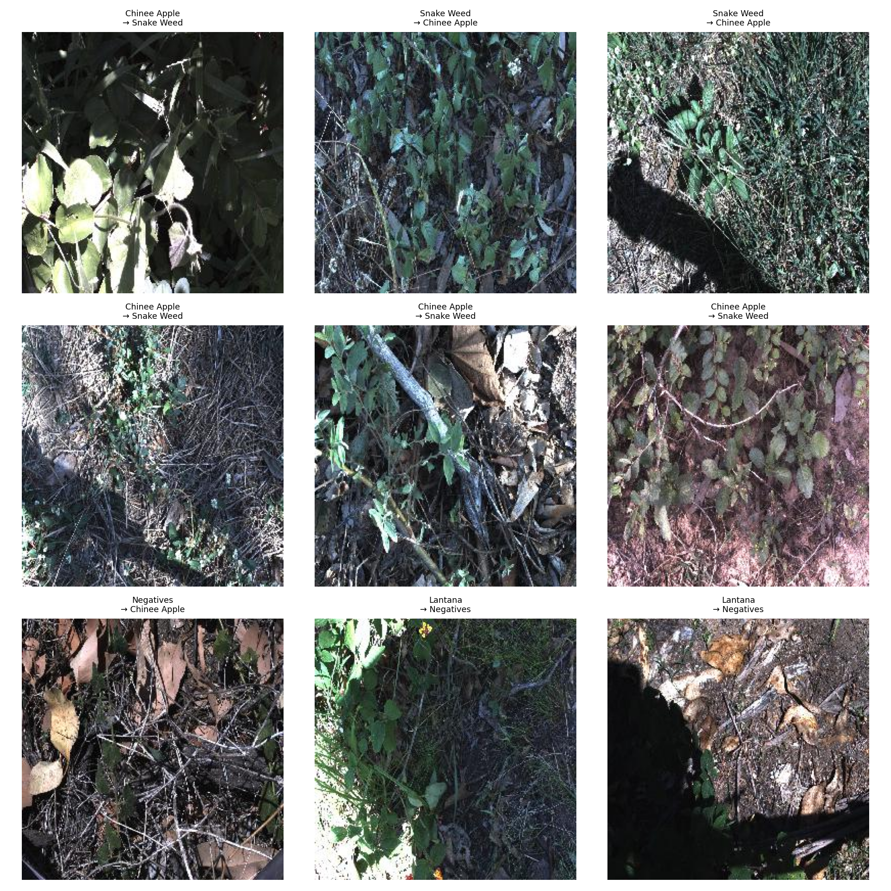

# Lab Day 2 — DeepWeeds: backbone, huấn luyện và suy luận

**Sinh viên:** Lê Trọng Khanh · **Mã số:** 2A202602941 · **Hoàn thiện:** 06/10/2026

## 1. Tóm tắt

Thực nghiệm phân loại 9 lớp DeepWeeds trên fold 0 cố định, gồm 5 backbone, 16 cấu hình huấn luyện và 9 phương pháp suy luận. Cấu hình chọn trên val là ConvNeXt-Tiny, fine-tune ImageNet, LR backbone/head cùng 1e-4, suy luận ba độ phân giải 224/256/288 và temperature scaling khớp riêng trên val. Qua 3 seed (0, 1, 2), accuracy test đạt **0.983081 ± 0.000718**, macro-F1 test đạt **0.978534 ± 0.000615**. Macro-F1 cao hơn mốc T00 + 1-view **0.005208**, lớn hơn std lớn nhất **0.000615**. Temperature scaling không giảm ECE test; đây là kết quả âm cần giữ nguyên. p95 suy luận ba scale đạt 22,09 ms trên Tesla T4, batch 1, chưa tính đọc ảnh/PIL/normalize/H2D.

## 2. Dữ liệu và thiết lập

DeepWeeds gồm 17.509 ảnh RGB 256×256, 8 loài cỏ và lớp Negative. Dùng nguyên các file `train_subset0.csv`, `val_subset0.csv`, `test_subset0.csv` của tác giả: **10.501 / 3.501 / 3.507** ảnh. Giao từng cặp tập bằng 0, hợp bằng 17.509; kiểm tra ảnh tồn tại và checksum ZIP đã thực hiện trong notebook. Train chỉ cập nhật trọng số; val chọn backbone, công thức, checkpoint, phương pháp suy luận và nhiệt độ; test chỉ được suy luận cuối mỗi seed. Hoàn thiện bài nộp chỉ đọc các CSV đã có, không chạy model lại trên test.

| Label | Lớp | labels.csv | Train fold 0 | Val fold 0 | Test fold 0 |
|---|---|---|---|---|---|
| 0 | Chinee apple | 1125 | 675 | 225 | 226 |
| 1 | Lantana | 1064 | 637 | 213 | 213 |
| 2 | Parkinsonia | 1031 | 618 | 206 | 207 |
| 3 | Parthenium | 1022 | 613 | 204 | 205 |
| 4 | Prickly acacia | 1062 | 637 | 212 | 213 |
| 5 | Rubber vine | 1009 | 605 | 202 | 202 |
| 6 | Siam weed | 1074 | 644 | 215 | 215 |
| 7 | Snake weed | 1016 | 609 | 203 | 204 |
| 8 | Negative | 9106 | 5463 | 1821 | 1822 |

Negative chiếm 52.01% dữ liệu; tỷ lệ lớp lớn nhất/nhỏ nhất là 9.02. Vì vậy metric chính là macro-F1 của 9 lớp, kèm top-1, balanced accuracy, precision/recall/F1 từng lớp, ECE 15 bin đều theo confidence lớn nhất. Mean/std dùng std mẫu `ddof=1`.

Có một khác biệt nhãn trong dữ liệu nguồn: `20170714-110407-3.jpg` mang Label 0 ở [train_subset0.csv của tác giả](https://raw.githubusercontent.com/AlexOlsen/DeepWeeds/master/labels/train_subset0.csv), nhưng Label 1 ở [labels.csv](https://raw.githubusercontent.com/AlexOlsen/DeepWeeds/master/labels/labels.csv). Do yêu cầu S1, giữ nguyên fold; tổng train+val+test theo lớp Chinee/Lantana lệch +1/−1 so với bảng tổng. Các file dự đoán được đối chiếu với đúng CSV split.





Môi trường chạy thật: **Python 3.13.15, PyTorch 2.11.0+cu128, timm 1.0.29, GPU Tesla T4**, theo output notebook. Công thức nền: 12 epoch, batch 64, crop 224, basic augmentation, CE, AdamW, LR backbone 1e-4/head 1e-3, weight decay 0,05, warmup 1 epoch rồi cosine, AMP khi train, không EMA. Norm/bias không weight decay; model ở eval khi đánh giá. Không có log version chính xác của các thư viện khác, không suy đoán từ máy hoàn thiện bài.

Kiểm tra pipeline đã chạy: CE ban đầu **2,196064**, gần ln(9)=2,197225; overfit batch nhỏ đạt loss **0,017691 sau 67 bước**; focal γ=0 trùng CE với sai số 0; CutMix λ thực **0,483398**. Ảnh sau augmentation và đường overfit được lưu dưới đây.





## 3. So sánh backbone

| Mã | Backbone | Tag trọng số | Params (M) | GMAC | F1 val | Top-1 val | s/epoch | p50 (ms) |
|---|---|---|---|---|---|---|---|---|
| B01 | resnet50 | resnet50.a1_in1k | 23.526 | 4.087 | 0.838223 | 0.880320 | 41.31 | 6.91 |
| B02 | resnext50_32x4d | resnext50_32x4d.a1h_in1k | 22.998 | 4.228 | 0.870980 | 0.899457 | 53.95 | 9.72 |
| B03 | convnext_tiny | convnext_tiny.in12k_ft_in1k | 27.827 | 4.457 | 0.971149 | 0.977721 | 48.84 | 6.66 |
| B04 | deit_small_patch16_224 | deit_small_patch16_224.fb_in1k | 21.669 | 4.600 | 0.955110 | 0.968295 | 31.99 | 5.81 |
| B05 | efficientnet_b0 | efficientnet_b0.ra_in1k | 4.019 | 0.386 | 0.852542 | 0.888603 | 28.76 | 9.42 |

Năm backbone đáp ứng ResNet, ResNeXt/ConvNeXt, transformer (DeiT) và mạng nhẹ (EfficientNet-B0), cùng split/công thức/seed 0. ConvNeXt đạt F1 val 0,971149, hơn DeiT 0,016039 và ResNet 0,132926. p50 ConvNeXt 6,66 ms và 27,827 triệu tham số: không phải nhỏ nhất nhưng có đánh đổi F1/độ trễ tốt trên T4. EfficientNet chỉ ước lượng chi phí kiến trúc thấp hơn; trên phần cứng này p50 vẫn 9,42 ms. Chọn ConvNeXt đi tiếp bằng val và chi phí đo thật.

Các tag pretrained khác nhau (ConvNeXt `in12k_ft_in1k`) nên so sánh phản ánh cả kiến trúc lẫn dữ liệu/công thức tiền huấn luyện, không cô lập riêng đóng góp kiến trúc. Mỗi backbone mới có 1 seed.



## 4. Ablation công thức huấn luyện

| Mã | Trục | Thay đổi so với T00 | F1 val | Δ F1 val |
|---|---|---|---|---|
| T00 | baseline | T00 | 0.971149 | +0.000000 |
| T01 | A | {"init": "scratch"} | 0.318543 | -0.652606 |
| T02 | A | {"init": "frozen"} | 0.851065 | -0.120084 |
| T03 | B | {"aug": "color"} | 0.970764 | -0.000385 |
| T04 | B | {"aug": "randaug"} | 0.973017 | +0.001868 |
| T05 | B | {"mix": "mixup"} | 0.970088 | -0.001061 |
| T06 | B | {"mix": "cutmix"} | 0.971834 | +0.000685 |
| T07 | C | {"loss": "ls", "label_smoothing": 0.1} | 0.974676 | +0.003527 |
| T08 | C | {"loss": "focal"} | 0.973064 | +0.001915 |
| T09 | C | {"loss": "ce_weighted"} | 0.971910 | +0.000761 |
| T10 | D | {"sampler": "balanced"} | 0.971565 | +0.000416 |
| T11 | E | {"lr_head": 0.0001} | 0.976119 | +0.004970 |
| T12 | F | {"ema_decay": 0.999} | 0.969252 | -0.001897 |
| T13 | G | img_size=256 | 0.973796 | +0.002648 |
| T14 | G | epochs=20 | 0.973372 | +0.002224 |
| T15 | combination | {"aug": "randaug", "loss": "ls", "label_smoothing": 0.1} | 0.975308 | +0.004160 |

T01–T14 thay đổi riêng một yếu tố so với T00; các tham số cùng kỹ thuật như `loss=ls` và `label_smoothing=0.1` thuộc cùng trục. T15 là kết hợp RandAugment + label smoothing. Bảy trục gồm khởi tạo, augmentation, loss, sampler, LR, EMA, ngân sách/độ phân giải.

Fine-tune vượt scratch (0,318543) và frozen (0,851065) trong 12 epoch; việc scratch thấp không chứng minh không thể học từ đầu nếu tăng ngân sách. Giảm LR head từ 1e-3 xuống 1e-4 (T11) đạt **0,976119**, Δ=+0,004970, là cải thiện lớn nhất trong các điều chỉnh quanh nền có pretrained. LR nhỏ hơn có thể giúp head ổn định hơn khi fine-tune; đây là giả thuyết, không phải đo trực tiếp gradient.

Label smoothing T07 Δ=+0,003527, RandAugment T04 Δ=+0,001868, nhưng ghép T15 đạt 0,975308, thấp hơn T11 và mức cộng đơn giản của hai Δ. Không có bằng chứng hiệu ứng cộng tuyến tính. CutMix Δ=+0,000685, balanced sampler +0,000416, color −0,000385 là chênh lệch nhỏ: không đủ cơ sở khẳng định lợi ích ổn định với chỉ một seed. Mixup và EMA không cải thiện ở thiết lập này; EMA 0,999 có thể cập nhật chậm trong lịch huấn luyện ngắn.

T13 tăng crop lên 256 đạt 0,973796; T14 kéo dài lên 20 epoch đạt 0,973372. Cả hai thấp hơn T11; 20 epoch là thí nghiệm riêng, không áp dụng cho mọi run. Log theo epoch và best epoch được bảo toàn ở `logs/history/` và JSON cấu hình.

Ba seed kiểm tra công thức 1-view: T00 F1 val **0.972478 ± 0.001249**; F01 (công thức T11) **0.973154 ± 0.002814**. Đây là metric training checkpoint 1-view trong `noise.json`; khác cột F01 val chung kết dùng ba scale. Không được trộn hai loại đánh giá khi phân tích nhiễu.





## 5. Suy luận và hiệu chuẩn

Tất cả phương pháp dưới đây dùng checkpoint F01 seed 0, chọn bằng val. Ensemble thêm DeiT B04 seed 0. I00 ở bảng này là 1-view của **F01**, còn mốc chung kết T00 + I00 dùng checkpoint T00.

| Mã | Phương pháp | K | F1 val | ECE val | p50 / p95 / p99 (ms) | ảnh/s batch 1 | Chi phí / I00 |
|---|---|---|---|---|---|---|---|
| I00 | identity | 1 | 0.976119 | 0.007198 | 6.96 / 7.68 / 8.90 | 143.62 | 1.00 |
| I01 | hflip (prob) | 2 | 0.976100 | 0.005647 | 14.30 / 15.80 / 16.40 | 69.91 | 2.05 |
| I02 | crop (prob) | 5 | 0.975535 | 0.005493 | 33.36 / 36.44 / 47.92 | 29.97 | 4.79 |
| I03 | hflip (logit) | 2 | 0.976100 | 0.005384 | 13.45 / 14.46 / 15.58 | 74.35 | 1.93 |
| I07 | temperature | 1 | 0.976119 | 0.003563 | 7.22 / 7.92 / 8.80 | 138.58 | 1.04 |
| I08amp | amp | 1 | 0.976119 | 0.007015 | 9.44 / 14.20 / 16.36 | 105.93 | 1.36 |
| I04 | identity | 1 | 0.973642 | 0.008132 | 7.87 / 12.78 / 12.82 | 127.05 | 1.13 |
| I02scale | scale | 3 | 0.978319 | 0.003553 | 20.49 / 22.09 / 23.38 | 48.79 | 2.94 |
| I05 | ensemble | 2 | 0.975029 | 0.009511 | 13.38 / 14.11 / 15.35 | 74.76 | 1.92 |

Ba scale (I02scale) đạt F1 val **0,978319**, tăng **0,002201** so với 1-view F01, tốn **2,94× p50**. Five-crop I02 và ensemble I05 thấp hơn 1-view; hflip gần như không đổi F1. I04 tăng riêng độ phân giải lên 288 làm F1 giảm xuống 0,973642; khác với trung bình nhiều scale. AMP suy luận có cùng F1 nhưng p50 9,44 ms so với FP32 6,96 ms: không mặc định FP16 nhanh hơn ở batch 1. ConvNeXt dùng LayerNorm nên gộp Conv-BN không tạo biến thể I08bn; sai số gộp 0 chỉ phản ánh không có cặp BN thích hợp, không phải tăng tốc đã được chứng minh.

I07 fit nhiệt độ trên val 1-view: T=1,203369, ECE val giảm **0,007198 → 0,003563**, F1 không đổi. Chung kết fit T riêng trên logits val của phương pháp ba scale cho từng seed, không dùng T của I07. Trên test, ECE mean **trước TS 0.004140 → sau TS 0.006258**; NLL cũng thay đổi **0.050690 → 0.050900**. TS tối ưu NLL val nên không đảm bảo ECE test giảm. Giữ nguyên cấu hình đã chốt trên val, không bỏ TS sau khi xem test.

Benchmark: warmup 10, 100 lượt đo, `torch.cuda.synchronize`, batch 1 và 32, FP32 hoặc AMP theo dòng Latency. Chi phí tensor views và aggregation được tính; đọc ảnh, PIL, normalize và chuyển CPU→GPU chưa tính. Ảnh/s trong bảng dùng batch/p50, là throughput suy ra từ benchmark; không phải tốc độ pipeline hoàn chỉnh. I02scale batch 32 đạt p50 535,79 ms, khoảng 59,73 ảnh/s.



## 6. Cấu hình chung kết và test

Chọn công thức T11, sao thành F01, rồi chọn I02scale trên val. Cấu hình đầy đủ tại `logs/final_plan.json`; hyperparameter chính như sau:

```json
{
  "config": {
    "exp_id": "F01",
    "seed": 0,
    "fold": 0,
    "backbone": "convnext_tiny",
    "init": "finetune",
    "drop_rate": 0.0,
    "img_size": 224,
    "aug": "basic",
    "sampler": null,
    "mix": null,
    "mix_alpha": 1.0,
    "loss": "ce",
    "label_smoothing": 0.0,
    "focal_gamma": 2.0,
    "class_weight_beta": null,
    "epochs": 12,
    "batch_size": 64,
    "lr_backbone": 0.0001,
    "lr_head": 0.0001,
    "weight_decay": 0.05,
    "warmup_epochs": 1.0,
    "ema_decay": null,
    "amp": true,
    "num_workers": 2,
    "save_test_predictions": false
  },
  "method": {
    "exp_id": "I02scale",
    "mode": "scale",
    "K": 3,
    "sizes": [
      224,
      256,
      288
    ]
  },
  "partner": "/kaggle/working/lab_day2_output/runs/B04/seed0/best.pt",
  "seeds": [
    0,
    1,
    2
  ]
}
```

Optimizer AdamW, warmup/cosine, checkpoint có F1 val lớn nhất (hòa chọn epoch sớm), trọng số `convnext_tiny.in12k_ft_in1k`; augmentation basic và normalization của pretrained model. Suy luận eval, resize theo 224/256/288, gộp theo code `logits_from_batch`, fit temperature trên val, áp dụng cùng T sang test. Partner DeiT trong plan được lưu để tái lập bộ lựa chọn; phương pháp cuối `scale` không dùng ensemble partner.

| Mã | Seed | F1 val | F1 test | Top-1 test | ECE test |
|---|---|---|---|---|---|
| T00 | 0 | 0.971149 | 0.973251 | 0.978614 | 0.010186 |
| F01 | 0 | 0.978319 | 0.978153 | 0.982321 | 0.006474 |
| T00 | 1 | 0.973627 | 0.972806 | 0.979184 | 0.008626 |
| F01 | 1 | 0.974141 | 0.978205 | 0.983177 | 0.005441 |
| T00 | 2 | 0.972658 | 0.973920 | 0.979184 | 0.007968 |
| F01 | 2 | 0.976821 | 0.979243 | 0.983747 | 0.006858 |

| Cấu hình | Macro-F1 val | Macro-F1 test | Top-1 test | Balanced acc test | ECE test |
|---|---|---|---|---|---|
| T00 | 0.972478 ± 0.001249 | 0.973326 ± 0.000561 | 0.978994 ± 0.000329 | 0.975929 ± 0.003645 | 0.008927 ± 0.001139 |
| F01 | 0.976427 ± 0.002117 | 0.978534 ± 0.000615 | 0.983081 ± 0.000718 | 0.977484 ± 0.001873 | 0.006258 ± 0.000733 |

Δ macro-F1 test **0.005208** (0.521 điểm phần trăm), bằng **8.47×** std lớn nhất 0.000615. Cải thiện lớn hơn nhiễu quan sát ở 3 seed, nhưng chưa có kiểm định trên nhiều fold để suy rộng thống kê. Chênh val/test F01 khoảng 0,002107, dưới 0,02.

| Cấu hình | Lớp | Số ảnh test | Precision mean ± std | Recall mean ± std | F1 mean ± std |
|---|---|---|---|---|---|
| T00 | Chinee apple | 226 | 0.967512 ± 0.009033 | 0.960177 ± 0.022992 | 0.963653 ± 0.006949 |
| T00 | Lantana | 213 | 0.968300 ± 0.026618 | 0.982786 ± 0.009773 | 0.975264 ± 0.008941 |
| T00 | Parkinsonia | 207 | 0.987023 ± 0.002749 | 0.979066 ± 0.005578 | 0.983019 ± 0.002463 |
| T00 | Parthenium | 205 | 0.998325 ± 0.002901 | 0.964228 ± 0.002816 | 0.980976 ± 0.001434 |
| T00 | Prickly acacia | 213 | 0.935925 ± 0.006706 | 0.982786 ± 0.005421 | 0.958782 ± 0.006023 |
| T00 | Rubber vine | 202 | 0.972376 ± 0.016781 | 0.981848 ± 0.010305 | 0.977043 ± 0.011309 |
| T00 | Siam weed | 215 | 0.969728 ± 0.009031 | 0.990698 ± 0.004651 | 0.980072 ± 0.003414 |
| T00 | Snake weed | 204 | 0.951595 ± 0.013453 | 0.959150 ± 0.011321 | 0.955258 ± 0.003477 |
| T00 | Negative | 1822 | 0.989152 ± 0.003235 | 0.982620 ± 0.004980 | 0.985864 ± 0.000899 |
| F01 | Chinee apple | 226 | 0.971719 ± 0.002693 | 0.963127 ± 0.006759 | 0.967401 ± 0.004699 |
| F01 | Lantana | 213 | 0.987478 ± 0.009582 | 0.978091 ± 0.009773 | 0.982703 ± 0.002730 |
| F01 | Parkinsonia | 207 | 0.974678 ± 0.005512 | 0.991948 ± 0.007379 | 0.983236 ± 0.006349 |
| F01 | Parthenium | 205 | 0.998342 ± 0.002872 | 0.977236 ± 0.007451 | 0.987666 ± 0.004298 |
| F01 | Prickly acacia | 213 | 0.965644 ± 0.005243 | 0.967136 ± 0.000000 | 0.966385 ± 0.002621 |
| F01 | Rubber vine | 202 | 0.981943 ± 0.010002 | 0.981848 ± 0.005716 | 0.981860 ± 0.003679 |
| F01 | Siam weed | 215 | 0.984596 ± 0.002624 | 0.990698 ± 0.000000 | 0.987636 ± 0.001321 |
| F01 | Snake weed | 204 | 0.965507 ± 0.007783 | 0.957516 ± 0.012336 | 0.961428 ± 0.003139 |
| F01 | Negative | 1822 | 0.987230 ± 0.001323 | 0.989755 ± 0.003121 | 0.988488 ± 0.000974 |

Recall Chinee apple và Snake weed lần lượt khoảng **96,31% và 95,75%**. Tăng F1 tổng không đồng nghĩa mọi lớp đều tăng recall: cần xem từng dòng của PerClass. Đặc biệt Snake weed vẫn thuộc nhóm F1 thấp nhất; Prickly acacia giảm recall so với mốc trong khi precision tăng.



| Seed F01 | Tổng ảnh sai / 3507 | Chinee → Snake | Snake → Chinee |
|---|---|---|---|
| 0 | 62 | 4 | 2 |
| 1 | 59 | 4 | 2 |
| 2 | 57 | 3 | 3 |



Ảnh lỗi cho thấy cặp Chinee apple ↔ Snake weed thường có nhiều cành/lá chồng nhau, vùng tối, chủ thể nhỏ hoặc lẫn thực vật nền. Một số Negative bị đoán là Chinee apple; Lantana bị thành Negative khi hoa/đặc trưng loài ít rõ hoặc bị nền gỗ che. Đây là giả thuyết từ ảnh đã quan sát, chưa có attention map để xác nhận model tập trung đúng vùng. Hướng cải thiện là kiểm tra nhãn, tăng dữ liệu điều kiện bóng râm/chủ thể nhỏ và thử crop theo đối tượng trên train/val.

## 7. Kết luận và triển khai

Trong so sánh val seed 0, chuyển từ ResNet sang ConvNeXt có Δ +0,132926, lớn hơn thay đổi LR head +0,004970 và multiscale +0,002201. Pretrained tag khác nhau khiến không thể quy toàn bộ Δ cho kiến trúc. Với ConvNeXt đã chọn, LR head đồng mức backbone là điều chỉnh tốt nhất trong ngân sách đã thử; thêm multiscale cải thiện vừa phải và có chi phí rõ ràng.

Với ngân sách **30–100 ms/khung trên Tesla T4**, chọn F01 ba scale + TS: p95 22,09 ms, macro-F1 test 0,978534 ± 0,000615. Latency đo cùng checkpoint seed 0/phương pháp scale; phép chia nhiệt độ vô hướng trong chung kết chưa được benchmark riêng cho ba scale. Do đó đây là thời gian phần suy luận đo được, cần đo end-to-end và trên phần cứng robot thật trước khi cam kết deadline. Nếu ngân sách thấp hơn, 1-view F01 là ứng viên p95 7,68 ms/F1 val 0,976119; chưa xuất test riêng cho 1-view F01 nên không gán F1 test của multiscale cho cấu hình đó.

Phần I tự chấm bằng `eval.py`: **18/20** (I1=7, I2=4, I3=4, I4a=0, I4b=1, I5=2), là điểm đề xuất theo ngưỡng tạm thời, không phải tổng điểm toàn bài. I4a không đạt vì ECE test sau TS cao hơn trước. Báo cáo kết quả âm và không điều chỉnh cấu hình bằng test.

## 8. Hạn chế và bước tiếp theo

Chỉ dùng fold 0; ablation/backbone/suy luận chủ yếu seed 0, chỉ công thức nền/chung kết có 3 seed. Chia ngẫu nhiên theo ảnh, không theo địa điểm, có thể cho điểm lạc quan khi nhiều ảnh cùng bối cảnh. Kết quả không chứng minh chuyển miền tốt theo vùng, mùa, ánh sáng hoặc camera. Có một nhãn train không khớp labels.csv ngay trong dữ liệu nguồn, đã giữ nguyên theo yêu cầu fold. 12 epoch là ngân sách chính, T14 riêng 20 epoch; chưa thử nhiều fold, distillation, ONNX hay Grad-CAM.

Chưa lưu các file checkpoint, logits cuối và temperature.json vào bài nộp; notebook và JSON đủ mô tả cách fit lại nhưng không có T chính xác từng seed. Version một số thư viện phụ chưa ghi. Code hiện tại và notebook xuất kết quả được giữ làm bằng chứng; các history được trích nguyên giá trị stdout theo epoch, không suy từ ảnh hoặc tạo giả log.

Nên ưu tiên xác nhận nhiều seed cho T11/T15, kiểm tra nhiều fold và split theo địa điểm, đo pipeline trên robot, rồi mới thử tăng ngân sách hay hiệu chuẩn trên dữ liệu miền đích độc lập. Không sử dụng test fold 0 để điều chỉnh các lựa chọn tiếp theo.

## 9. Phụ lục và truy xuất số liệu

`results.xlsx` gồm Backbones, Training, Inference, Final, PerClass, Latency, Summary. Bảng backbone/training dùng JSON log; metric chung kết và toàn bộ dự đoán được tính lại qua `eval.py` không sửa. `logs/` chứa cấu hình và `history/<exp_id>/seed<k>/history.csv` cho 26 run. `curves/` có 26 PNG tương ứng; `predictions/` có 44 CSV với Filename, y_true, y_pred, p0…p8. `eval_out/validation.json` ghi hash SHA-256 từng CSV và kết quả kiểm tra.

Notebook chạy thật: [code/lab_day2.ipynb](code/lab_day2.ipynb), giữ output thực nghiệm. Link web Kaggle bổ sung tại README khi có URL chính xác từ người chạy. Các cấu hình theo từng exp_id nằm trong `logs/backbones.json`, `logs/training.json`, `logs/noise.json`; thứ tự chạy và lệnh xác minh nằm trong README.
